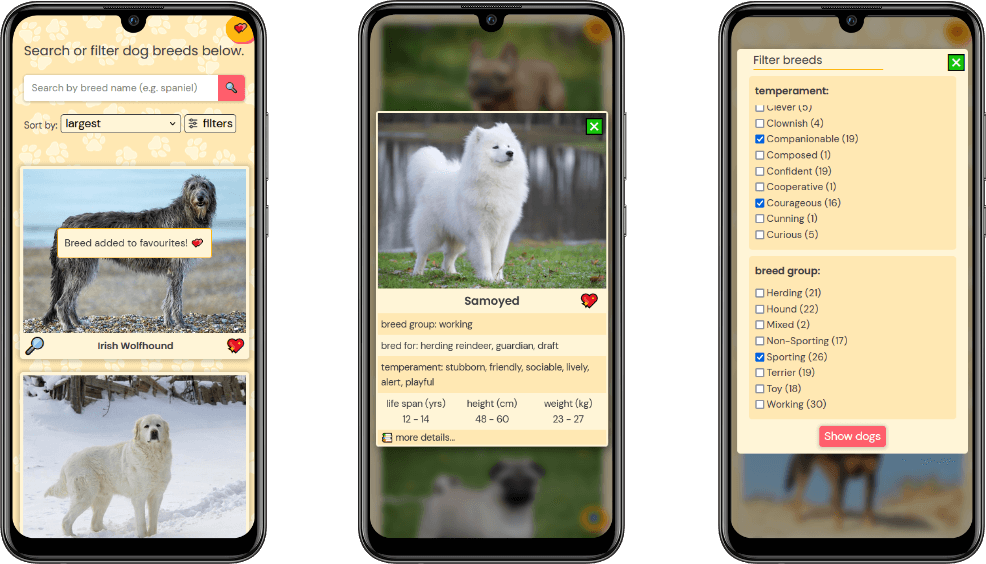

# AllBest Dogs

App with a lot of dogs 🐶 that allows a user to find and get to know details about over 200 breeds of these great animals.

> Live demo [_here_](https://allbestdogs.netlify.app/).

## Table of Contents

- [General Info](#general-information)
- [Technologies Used](#technologies-used)
- [Features](#features)
- [Screenshots](#screenshots)
- [Setup](#setup)
- [Usage](#usage)
- [Project Status](#project-status)
- [Room for Improvement](#room-for-improvement)
- [Acknowledgements](#acknowledgements)
- [Contact](#contact)
<!-- * [License](#license) -->

## General Information

User can search breeds in a multiple ways: type a breed name inside of a search bar, sort by predefined categories, or use an advanced filter.

There is also an option to add breeds to favourites.

Project made to practice work with REST API, organizing code with modules, using parcel and handling errors.

## Technologies Used

- Parcel,
- ES Modules,
- REST API,
- Error handling,
- Local storage.

## Features

- search bar,
- sorting options,
- advanced filtering by multiple characteristics of breed temperament and breed group,
- add breed to favourites,
- view breed details in the external source

## Screenshots

- Filter view

  

- Breed card view

  

- Favourites basket view

  

- Mobile view

  

## Setup

> install dependencies

$ npm install

> build for production and launch server

$ npm run build
$ npm run start
